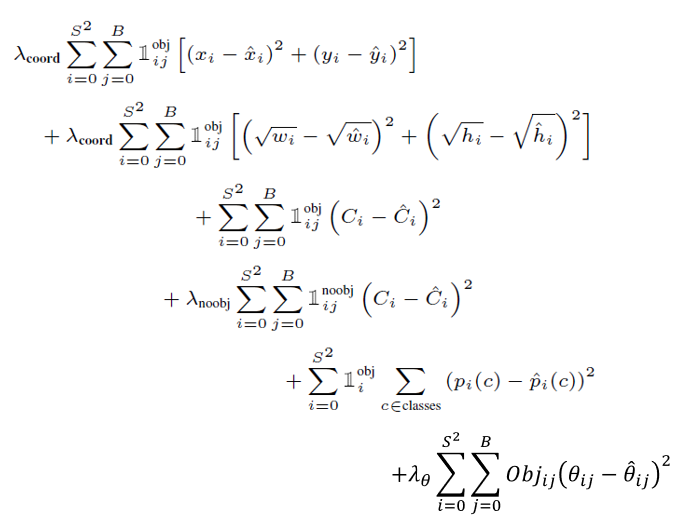
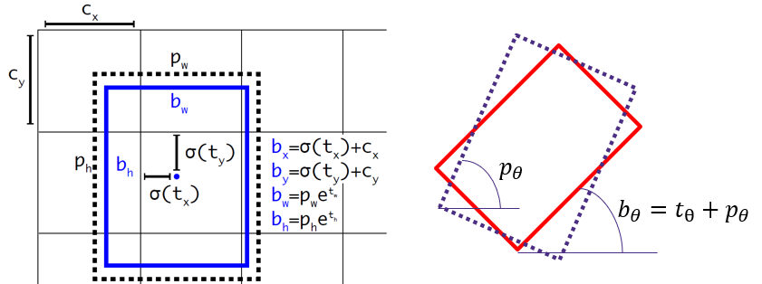

# Rotated Bounding Box Detection With YOLOv2

This repository contains the implementation of real-time object 2.5D pose detection using YOLOv2. The project focuses on adapting the YOLOv2 model to efficiently detect the 2D position and orientation of objects in a 3D space. The motivation is to provide a solution that balances performance and hardware constraints, making it suitable for applications such as robotics, augmented reality, and autonomous driving.

## Introduction

In this project, the goal is to address the challenge of real-time object pose detection using the YOLOv2 model. Object pose detection involves determining the 2D position and orientation of objects in a 3D space, and it is crucial for various applications. The primary focus is on developing an efficient and real-time solution that takes into account both performance and hardware constraints.

Previous approaches, including the use of YOLOv4, have shown promise but often demand substantial computational resources. This project leverages YOLOv2 for its efficiency and compatibility with hardware limitations. The adaptation of YOLOv2 includes modifying the output shape, anchor boxes, and loss function to incorporate 2.5D pose information.

### Key Contributions

1. Evaluation of the performance of YOLOv2 for real-time object pose detection.
2. Adaptation of YOLOv2 to incorporate 2.5D pose information, with modifications to the output shape, anchor boxes, and loss function.
3. Demonstration of the feasibility of real-time object pose detection with YOLOv2, considering hardware constraints.

## Method

The method involves a stepwise approach to achieve real-time object pose detection:

1. **Baseline:** Utilization of the standard YOLOv2 model as a baseline for real-time object detection.
2. **Network for Object Pose Detection:** Adaptation of the YOLOv2 architecture to incorporate 2.5D pose information, involving adjustments to the output shape and loss function.
3. **Training:** Training the network from scratch to ensure compatibility with the wood block dataset and specific requirements of real-time pose detection.
4. **Anchor Boxes:** Use of 16 square anchor boxes with an angle range to contribute to accurate localization of objects and their poses.
5. **Loss Function:** In addition to the original YOLOv2 loss function, the smooth L1 loss is employed to handle angle information in the pose estimation task.
6. **Training Configuration:** Training conducted with specific configurations such as learning rate, number of epochs, and hardware specifications.

## Results

The performance of the proposed method and the baseline (standard YOLOv2) was evaluated on the wood block dataset using Mean Average Precision (mAP) at IoU threshold 0.5.

| Method             | mAP@0.5 (%) |
|--------------------|-------------|
| Baseline           | 88.2        |
| Modified Method    | 88.9        |

https://github.com/yaohwang99/yolov2-pytorch-rotated-bounding-box/assets/95354972/0a54c460-302d-4aaa-9942-61198a9b5afc

## Conclusion

This project explores the feasibility of real-time object pose detection using YOLOv2. The adaptation of YOLOv2 to incorporate 2.5D pose information shows promising results. Future improvements may involve refining the model architecture and exploring additional datasets for enhanced generalization.

## References

- Redmon, J., Divvala, S., Girshick, R., & Farhadi, A. (2016). You Only Look Once: Unified, Real-Time Object Detection. [arXiv:1506.02640](https://arxiv.org/abs/1506.02640)
- Redmon, J., & Farhadi, A. (2017). YOLO9000: Better, Faster, Stronger. [arXiv:1612.08242](https://arxiv.org/abs/1612.08242)
- Yang, X., Yan, J., Feng, Z., & He, T. (2020). R3Det: Refined Single-Stage Detector with Feature Refinement for Rotating Object. [arXiv:1908.05612](https://arxiv.org/abs/1908.05612)
- Yang, X., Zhou, Y., Zhang, G., Yang, J., Wang, W., Yan, J., Zhang, X., & Tian, Q. (2023). The KFIOU Loss for Rotated Object Detection. [arXiv:2201.12558](https://arxiv.org/abs/2201.12558)
- [R-YOLOv4 GitHub Repository](https://github.com/kunnnnethan/R-YOLOv4)
- [Yolo-v2-pytorch GitHub Repository](https://github.com/uvipen/Yolo-v2-pytorch)

